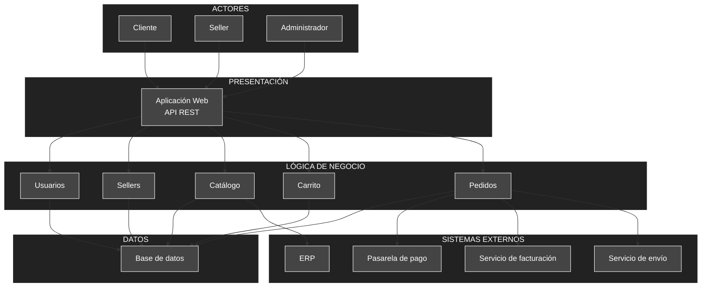

## Arquitectura Inicial

```text
┌────────────────────────────────────┐
│           PRESENTACIÓN             │
│                                    │
│       Web / API / Interfaz         │
└─────────────────┬──────────────────┘
                  │
                  ▼
┌────────────────────────────────────┐
│          LÓGICA DE NEGOCIO         │
│                                    │
│  Catálogo                          │
│  Carrito                           │
│  Pedidos                           │
│  Sellers                           │
│  Usuarios                          │
└─────────────────┬──────────────────┘
                  │
                  ▼
┌────────────────────────────────────┐
│                DATOS               │
│                                    │
│            Base de datos           │
└────────────────────────────────────┘


# Arquitectura Inicial del Sistema

## Diagrama de Arquitectura



## Descripción

La arquitectura inicial del Marketplace se organiza en **tres capas principales**: presentación, lógica de negocio y datos. Esta estructura permite separar las responsabilidades principales del sistema y establecer una base para la evolución de la arquitectura.

### 1. Presentación

La capa de **Presentación** proporciona el punto de interacción entre los actores y el sistema mediante una **aplicación web**, utilizando una **API REST** para la comunicación con los componentes de negocio.

Los principales actores son:

* **Cliente:** consulta productos, gestiona su carrito y realiza pedidos.
* **Seller:** registra y gestiona sus productos.
* **Administrador:** administra la plataforma.

### 2. Lógica de Negocio

La capa de **Lógica de Negocio** contiene los módulos principales del Marketplace:

* **Usuarios:** gestiona la información y operaciones relacionadas con los usuarios.
* **Sellers:** gestiona la información de los vendedores y sus productos.
* **Catálogo:** permite consultar productos y su disponibilidad.
* **Carrito:** gestiona los productos seleccionados por el cliente.
* **Pedidos:** permite generar y consultar los pedidos realizados.

### 3. Datos

La capa de **Datos** está conformada por una **base de datos**, encargada de almacenar la información relacionada con usuarios, sellers, productos, carritos y pedidos.

### 4. Sistemas Externos

La arquitectura considera la integración con servicios externos:

* **Pasarela de pago:** procesa los pagos asociados a los pedidos.
* **Servicio de facturación:** genera los comprobantes de pago.
* **Servicio de envío:** gestiona la información relacionada con la entrega de los pedidos.
* **ERP:** proporciona información relacionada con productos y disponibilidad de stock.

Estas integraciones permiten que el Marketplace delegue funcionalidades especializadas a sistemas externos mediante mecanismos de comunicación basados en **API REST**.

## Flujo General

El flujo principal de la arquitectura es:

```text
Actores
   │
   ▼
Presentación
(Web / API REST)
   │
   ▼
Lógica de Negocio
   │
   ├── Usuarios
   ├── Sellers
   ├── Catálogo
   ├── Carrito
   └── Pedidos
          │
          ▼
      Base de Datos

Pedidos ──────► Pasarela de pago
Pedidos ──────► Facturación
Pedidos ──────► Servicio de envío
Catálogo ─────► ERP
```

## Relación con los Drivers Arquitectónicos

La arquitectura inicial considera los principales drivers identificados durante el análisis:

| Driver                      | Consideración arquitectónica                                                                                  |
| --------------------------- | ------------------------------------------------------------------------------------------------------------- |
| **DA01 – Escalabilidad**    | La separación de responsabilidades permite evolucionar y escalar los componentes del sistema.                 |
| **DA02 – Rendimiento**      | La separación entre presentación, negocio y datos facilita optimizar el procesamiento y acceso a información. |
| **DA03 – Seguridad**        | La API y la capa de negocio pueden incorporar mecanismos de autenticación y autorización.                     |
| **DA04 – Pasarela de pago** | Se contempla una integración independiente con la pasarela de pago externa.                                   |
| **DA05 – API REST**         | La comunicación entre la aplicación web y la lógica del sistema se establece mediante API REST.               |

## Tipo de Arquitectura

La propuesta corresponde inicialmente a una **arquitectura en capas**, utilizada como punto de partida para organizar las responsabilidades del Marketplace.

Esta arquitectura podrá evolucionar posteriormente de acuerdo con los requisitos funcionales, atributos de calidad, restricciones y necesidades de integración identificadas en el proyecto.
